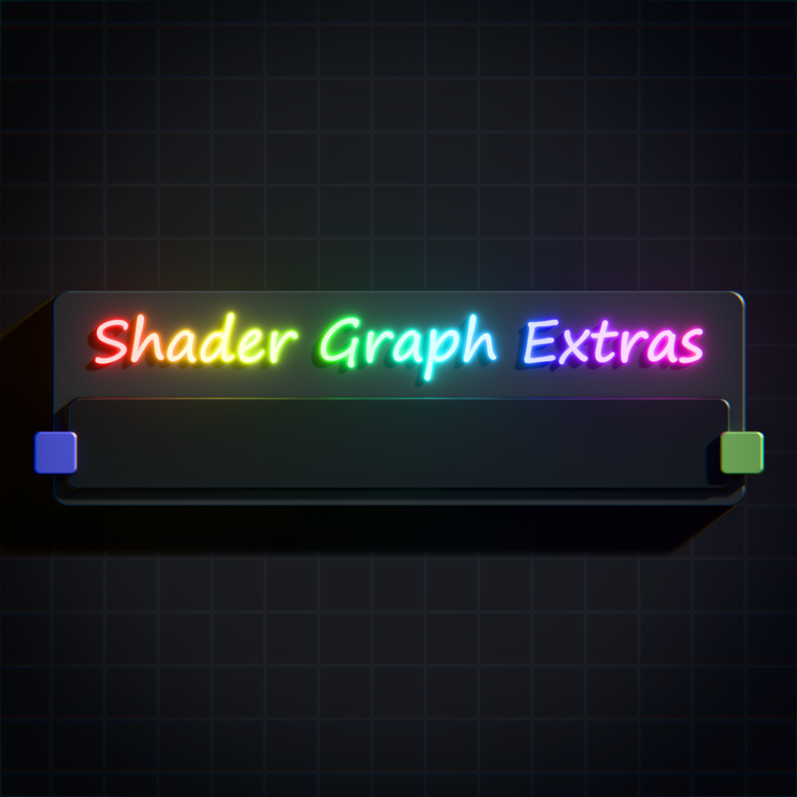

# Shader Graph Extras for s&box

## Introduction

A brand new "Upgraded Shader Graph" with additional nodes, subgraphs, HLSL functions, custom shader templates, custom shading models, various optimizations and other advanced features. Some nodes and subgraphs are available in both the base Shader Graph and Upgraded Shader Graph under the "Shader Graph Extras - Universal" menu when selecting nodes in the graph. Upgraded Shader Graph is already compatible with .shdrgrph and .shdrfunc files created using base Shader Graph.

## Getting Started

Simply right click on an already existing .shdrgrph or .shdrfunc in the asset browser and click "Open with Upgraded Shader Graph", or go top left in your editor in the tools tab and select "Upgraded Shader Graph" there. If you use any nodes in the "Shader Graph Extras - Upgraded" menu only available in the Upgraded Shader Graph and hit save, then your files won't be compatible with base Shader Graph anymore.

## Features

### 🎨 Enhanced Texture Support
- Define **Texture Sampler**, **Texture 2D**, and **Texture Cubemap** inputs and outputs for nodes and subgraphs.

### ✨ New Nodes, Subgraphs and HLSL functions.
- Access to **45 additional combined nodes and subgraphs** along with **HLSL functions which can be used without Shader Graph**.
    - Nodes are located in `Editor\nodes\`.
    - Subgraphs are located in `Assets\shaders\subgraphs\`.
    - HLSL functions are located in `Assets\shaders\hlsl\`.

### 🎭 Dynamic Blend Mode
- Setting this blending mode will allow you to select **Alpha Test** or **Translucent** directly in the Material Editor (default being **Opaque**), instead of being stuck with only hardcoded **Opaque**, **Alpha Test** and **Translucent** options generated by base Shader Graph.

    

### 💡 Custom Shading Models
- Inject **custom shading models** directly into Shader Graph:
    - Examples of Shading Domains located in `Editor\shadingmodels\`.
    
    

### 📋 Custom Shader Templates
- Inject **custom shader templates** directly into Shader Graph:
    - Examples of Shader Templates located in `Editor\templates\`.
    
    

### 🔀 Combo Definitions
- Using the combo node, you can define whether to use a combo with static/dynamic mode or bool/enum type for your shader logic. Can be controlled via material editor or C# just like regular written combos.

    

### ✏️ Node Multi-Editing
- Select multiple nodes of the same or different types and edit their shared properties all at once. Shared properties, UI settings, sampler configurations, and group/sub-group assignments are automatically detected and displayed in a unified inspector panel. Priority fields support relative adjustments (e.g. `+5` or `-3`) so nodes can be offset without overwriting individual values. Group and sub-group name fields offer autocompletion from existing groups in the graph.

    

### 🐛 Bug Fixes
- Resolves multiple GitHub issues:

    - [#7327](https://github.com/Facepunch/sbox-issues/issues/7327), [#7380](https://github.com/Facepunch/sbox-issues/issues/7380), [#7471](https://github.com/Facepunch/sbox-issues/issues/7471), [#8088](https://github.com/Facepunch/sbox-issues/issues/8088), [#8244](https://github.com/Facepunch/sbox-issues/issues/8244), [#8544](https://github.com/Facepunch/sbox-issues/issues/8544), [#8588](https://github.com/Facepunch/sbox-issues/issues/8588), [#8741](https://github.com/Facepunch/sbox-issues/issues/8741), [#8743](https://github.com/Facepunch/sbox-issues/issues/8743), [#8781](https://github.com/Facepunch/sbox-issues/issues/8781), [#8814](https://github.com/Facepunch/sbox-issues/issues/8814), [#9027](https://github.com/Facepunch/sbox-issues/issues/9027), [#9589](https://github.com/Facepunch/sbox-issues/issues/9589).

### 📚 Tutorials
- In-depth tutorials for every node, subgraph, shader template and shading model located in `Assets\shaders\shadergraphs\tutorials\`.

---

## Support

For issues, feature requests, or contributions, please refer to the project's issue tracker or contact [eeight3d](https://discord.com/users/1187194205580312726) on discord.

---
